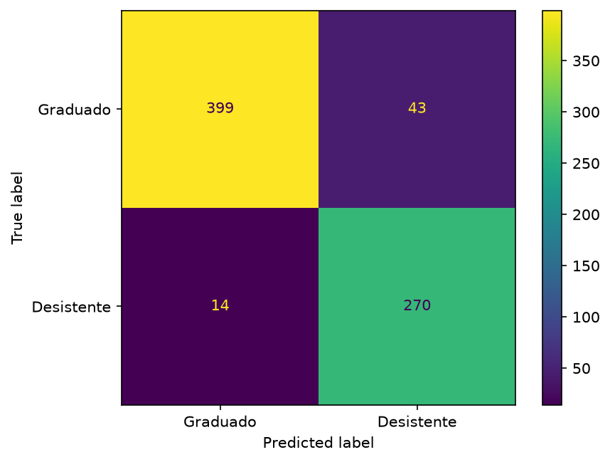
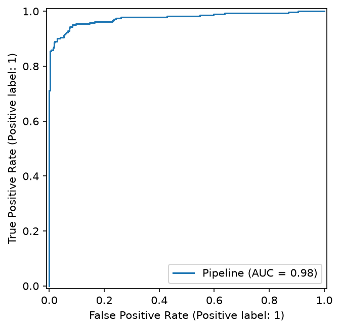

# 🎓 Previsão de evasão de estudantes

Pipeline de Machine Learning ponta a ponta para prever evasão (`Desistente`) de
estudantes universitários a partir do desempenho acadêmico, com deploy de um
app Streamlit em AWS. Projeto da Prova Substitutiva — Fase 3 (Machine
Learning Engineering), Pós-Graduação FIAP.

- **App no ar**: http://54.152.211.196/
- **Vídeo explicando o projeto**: _(pendente)_

## 🎯 O problema

Dado o histórico acadêmico de um aluno (notas, aprovações por semestre,
situação financeira, curso, dados demográficos), o objetivo é prever se ele
vai evadir (`Desistente`) da faculdade — um problema de classificação binária.

## 🛠️ Feature engineering

- Colunas derivadas do desempenho acadêmico (`src/features.py`):
  - `no_courses_full_year`: flag pra quem não se inscreveu em nenhuma matéria
    no ano (152 alunos) — evita que a taxa de aprovação vire 0/0 (indefinido)
    e seja confundida com quem reprovou em tudo.
  - `approval_rate_sem1` / `approval_rate_sem2`: `Aprovado / Inscrito` por semestre.
  - `grade_delta` / `approval_rate_delta`: evolução do aluno entre o 1º e o 2º semestre.
- Colunas mais correlacionadas com evasão: `UnidadesCurriculares2SemestreAprovado`
  (0,65), `1SemestreAprovado` (0,55), `MensalidadesEmDia` (0,44).
- Pré-processamento (`ColumnTransformer`): numéricas com `SimpleImputer`
  (mediana) + `StandardScaler`; categóricas com `SimpleImputer` (moda) +
  `OneHotEncoder(handle_unknown="ignore")`. A base de treino não tem nulos —
  os imputers existem para robustez com dado novo (ex.: um input do app com
  campo faltando), não porque a base atual precise.
- **Decisão de arquitetura**: a correção do bug das notas e a derivação das
  features acadêmicas vivem como `FunctionTransformer`s dentro do `Pipeline`
  sklearn (`build_full_pipeline`, em `src/features.py`), não aplicadas uma
  vez sobre o DataFrame bruto. Assim, dado novo e cru — uma linha vinda do
  formulário do app, por exemplo — passa direto por `.predict()` sem nenhum
  pré-processamento manual.

## 🤖 Modelagem

- **Split**: 80/20 estratificado, `random_state=42` (`(2904, 32)` / `(726, 32)`).
- **Validação cruzada**: `StratifiedKFold` (k=5) em cada um dos 6 pipelines
  candidatos: Logistic Regression, Random Forest e XGBoost, cada um com e sem
  balanceamento de classe (`class_weight="balanced"` / `scale_pos_weight`).
- **Métrica principal**: F1-score e ROC-AUC (accuracy sozinha é enganosa mesmo
  com desbalanceamento leve).
- **Tracking**: todos os runs (params, métricas por fold, artefatos) logados
  no MLflow (`evasao-estudantil-cv`); modelo final registrado no Model
  Registry (`evasao-estudantil-logreg-balanced`).

### Resultados da validação cruzada

| Modelo | F1 (treino) | F1 (validação) | Gap F1 | ROC-AUC (validação) |
|---|---|---|---|---|
| Logistic Regression | 0.890 | 0.878 | 0.012 | 0.948 |
| Logistic Regression (balanced) | 0.887 | 0.872 | 0.015 | 0.948 |
| XGBoost (balanced) | 1.000 | 0.872 | 0.128 | 0.939 |
| Random Forest (balanced) | 1.000 | 0.871 | 0.129 | 0.947 |
| XGBoost | 1.000 | 0.871 | 0.129 | 0.938 |
| Random Forest | 1.000 | 0.866 | 0.134 | 0.948 |

## 📉 Overfitting e underfitting

Comparando desempenho em treino vs. validação (dentro do CV):

- **Logistic Regression**: gap treino×validação de 1 a 2 pontos percentuais
  em todas as métricas — comportamento saudável, o modelo aprendeu um padrão
  real em vez de decorar o treino.
- **Random Forest e XGBoost**: praticamente memorizam o treino (F1 ≈ 1.00),
  mas caem pra ~0.87 na validação — gap de mais de 10 pontos, overfitting
  clássico. Testamos limitar `max_depth`: a partir de ~7 o F1 de validação já
  não melhora mais, mas o gap treino-validação continua crescendo se a árvore
  fica mais profunda — ou seja, mais complexidade depois desse ponto só
  aumenta o overfitting, sem ganho real.
- **Underfitting**: não encontramos evidência. Um modelo underfitando teria
  desempenho ruim tanto no treino quanto na validação; mesmo a Logistic
  Regression (a mais simples) chega perto do desempenho das árvores na
  validação, mostrando que já captura bem o padrão principal do problema.

**Modelo escolhido**: Logistic Regression (balanced) — menor gap
treino×validação entre os 6 candidatos, e melhor recall da classe
`Desistente` (o que importa mais no negócio: identificar quem está em risco).

### Avaliação final (holdout, nunca visto no CV)

| Métrica | Valor |
|---|---|
| F1 | 0.905 |
| ROC-AUC | 0.976 |
| Recall (Desistente) | 0.95 (14 falsos negativos em 284) |

<p float="left">
  
  
</p>

## 🏗️ Arquitetura do projeto

```
src/                  # pipeline de ML (usado por main.py e backend/)
  config.py           # constantes: paths, colunas, hiperparâmetros
  data.py             # carga e split enrolled/outcomes
  features.py         # correção do bug de notas, features derivadas, Pipeline
  train.py            # CV dos 6 candidatos, seleção do modelo final
  evaluate.py         # avaliação de holdout, MLflow registry, scoring de matriculados
main.py               # entrypoint de (re)treino: roda o pipeline completo

backend/              # API FastAPI — dono do modelo treinado e do dataset
  main.py             # GET /defaults, POST /predict (autenticado via X-API-Key)

app/                  # frontend Streamlit — só UI, fala HTTP com o backend
  streamlit_app.py

notebooks/            # prototipação original (EDA + primeira versão do treino)
docs/img/             # figuras de avaliação (matriz de confusão, ROC)
docs/api/             # OpenAPI/Swagger + coleção Postman do backend
deploy/               # script + instruções de deploy na EC2
docker-compose.yml            # base: backend só na rede interna (não publicado)
docker-compose.override.yml   # local: publica o backend na 8000 (debug/Postman)
docker-compose.prod.yml       # EC2: publica o frontend na porta 80
```

Backend e frontend são serviços separados de propósito: o backend concentra o
modelo/dataset e não precisa ficar acessível publicamente (só o frontend fala
com ele, autenticado via header `X-API-Key`); o frontend não tem nenhuma
dependência de ML (`joblib`/`pandas`/`scikit-learn`), só UI e `requests`.

## 🚀 Como rodar localmente

### Treinar o modelo do zero

```
uv sync
uv run python main.py
```

Gera `models/logistic_regression_balanced.joblib`, as figuras em `docs/img/`,
`data/top_risk_students.csv`, e loga tudo no MLflow local.

### Rodar o app (backend + frontend)

Com Docker ou Podman (recomendado — testado com ambos):

```
cp .env.example .env
# edite .env e troque o valor por um gerado com: openssl rand -hex 32
docker compose up --build
# ou: podman-compose up --build
```

Abre em `http://localhost:8501`. O `docker-compose.override.yml` é carregado
automaticamente e publica o backend em `localhost:8000` também (útil pra
testar via Postman/`http://localhost:8000/docs` — ver `docs/api/README.md`).

Sem Docker, em dois terminais:

```
uv run uvicorn backend.main:app --port 8000          # backend
BACKEND_URL=http://localhost:8000 uv run streamlit run app/streamlit_app.py  # frontend
```

(defina `API_KEY` igual nos dois terminais).

## ☁️ Deploy (AWS EC2)

- **Instância**: Amazon Linux 2023, `t3.micro`, 20GB gp3, Elastic IP
  `54.152.211.196` (não muda se a instância reiniciar).
- **Security Group**: só 22 (SSH) e 80 (HTTP) liberados. O backend (porta
  8000) nunca é exposto publicamente.
- Script completo de setup em [`deploy/ec2-setup.sh`](deploy/ec2-setup.sh) —
  instala Docker, cria swap (RAM curta do `t3.micro` pro build), clona o
  repo, gera a `API_KEY` e sobe os containers com
  `docker compose -f docker-compose.yml -f docker-compose.prod.yml up -d --build`.
  Passo a passo em [`deploy/README.md`](deploy/README.md).

## 📖 Documentação da API

O backend expõe `GET /defaults` e `POST /predict` (autenticados via
`X-API-Key`). Schema OpenAPI/Swagger, coleção Postman e instruções de uso em
[`docs/api/`](docs/api/README.md).

## 🔮 Evoluções futuras

O projeto treina e serve o modelo, mas o retreino ainda é manual
(`uv run python main.py`, commit do novo `.joblib`, redeploy). O próximo passo
natural de MLOps seria um pipeline de retreino **agendado** (dado de aluno
chega por semestre, não a qualquer momento — um cron/DAG bate mais que uma
API sob demanda):

1. Dados novos de um semestre sobem pra um bucket S3.
2. Uma DAG do Airflow, rodando periodicamente, reprocessa a base e chama a
   mesma lógica já pronta em `src/train.py` + `src/evaluate.py` — sem
   reescrever nada, é exatamente por isso que essa lógica foi extraída do
   notebook para módulos reutilizáveis.
3. O novo `.joblib` sobe versionado pro S3 (permite rollback), métricas/params
   ficam no MLflow, e o novo modelo é registrado no Model Registry.
4. O backend passa a servir a versão nova (redeploy do container, ou
   polling/reload a partir do Model Registry).

## 🔗 Links da entrega

- Repositório: https://github.com/rebertmatheus/fiap-tech-challenge-sub-fase-3
- App em produção: http://54.152.211.196/
- Vídeo: _(pendente)_
